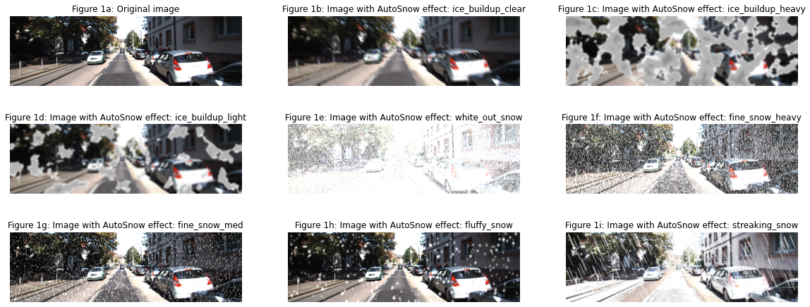
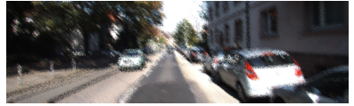
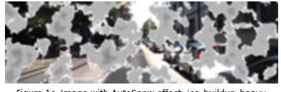
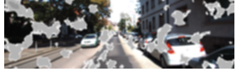
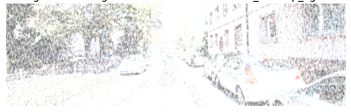
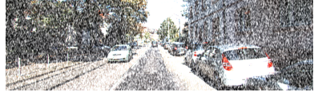
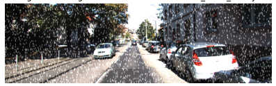
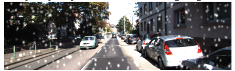
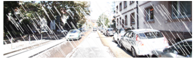

# AutoSnow: A synthetic winter image generator framework, used to study and test object detection systems



AutoSnow is a framework for generating synthetic winter image data from clear weather images by using simple python tools like NumPy and OpenCV. AutoSnow can efficiently transform images to generate 8 unique winter weather conditions. 
This project uses AutoSnow to generate synthetic winter datasets to test object detection models trained on clear weather data. We also provide the tools needed to test clear weather models on real winter data.  We use AutoSnow to generate synthetic winter testing data to retrain an object detection model in an attempt to make it more robust to real winter data. These models are included in the repo for experimentation

## Setup
To use this project please ensure the Numpy, OpenCV, and Pytorch libraries are installed on your system, this can be done using pip.
To install the third-party libraries used, please run all the cells in the provided notebook titled “Setup_libs"

## Third-party libraries
- [**YOLOv5:**](https://github.com/ultralytics/yolov5) This library is the object detection framework used in this project to train our models. It allows for easy training and utilization of models trained with different data. We used YOLOv5s model trained on the COCO dataset. Then we further finetune this model by training it with our dataset.
- [**Automold:**](https://github.com/UjjwalSaxena/Automold--Road-Augmentation-Library) This library is used for its method to generate snow on the ground.
- [**Object Detection Metrics toolkit:**](https://github.com/rafaelpadilla/review_object_detection_metrics)  This library provides a toolkit with a GUI for calculating the accuracy metrics for an object detection model. It input the prediction label and ground truth labels and outputs several accuracy metrics.

## Data
This project uses two datasets. The first was a clear weather dataset which we used to train the baseline clear model. A subset of this dataset would also be used as the clear weather test dataset, as well as forming the dataset used for transforming into winter data. The popular [KITTI 2D object detection dataset](http://www.cvlibs.net/datasets/kitti/eval_object.php?obj_benchmark=2d) is used.

Our second dataset was the [Canadian Adverse Driving Conditions Dataset (CADCD)](http://cadcd.uwaterloo.ca/) which is a winter weather driving dataset made by the University of Waterloo. This dataset was used as our real winter dataset and would be used to test our clear weather and synthetic winter models on real winter conditions.

Only a few samples immages of each dataset are included in this repo to keep in small (would be 30GB+ otherwise!). Please download these datasets separately and format them using the tools provided.


---
## How to use:

### Download and format the KITTI dataset
-	Download KITTI dataset from [here](http://www.cvlibs.net/datasets/kitti/eval_object.php?obj_benchmark=2d)
-	Use *kitti_label.py* to convert KITTI object label into form YOLO expects, as well as, generating lists of file # to be split into testing and training data. Run using command:
```python kitti_label.py path/to/kitti/data_object_label_2/training/label_2 path/to/kitti/data_object_image_2/training/image_2 --training-samples 0.71 ```
-	Run *split_data.py* to split KITTI data from list previously generated and create testing and training folders as required by YOLO. Run using command ```python split_data.py```

### Download and format the CADCD dataset
-	Download CADCD dataset from [here](http://cadcd.uwaterloo.ca/)
-	Use *cadc_3d_to_2d.py* to convert 3D labels into 2D labels, as well as to the YOLO format.
Run using command:  `python filename.py unpack /path/to/download_data_dir`
-	No splitting required since this data is only used for testing.

### Training model
-	To test model run the command: ```cd yolov5 && python train.py --img 1242 --batch 4 --epochs 15 --data clear_weather_dataset.yaml --weights yolov5s.pt --workers 2```
-	--img: is the size of the longest side of the images you are training with.
-	--batch: number of images trained at a time (can increase depending on graphics card memory)
-	--data: This is the path to a yaml file which specifies the location of training and testing data and class labels. We provide 2 yaml files *clear_weather_dataset.yaml* and *winter_weather_dataset.yaml* for training the clear weather model and synthetic winter weather model respectively.
-	--weights: the original weights model that will be further finetuned by training. 
-	When training is complete retrieve model file from `yolov5/runs/train/\<latest exp\>/weights/last.pt` and save it in main directory.

-	This training step can be skipped since we have provided our pretrained models stored as *clear_weather_model.pt* and *winter_weather_model.pt* that can be used for testing.

### Creating synthetic data
-	To create the synthetic testing and training data simply run all the cells in the “CS855 AutoSnow Project notebook.ipynb” file. This notebook is contains the AutoSnow methods and also has the code needed to generate the folders, labels, and images for the synthetic datasets.

### Testing model 
-	To generate prediction labels with a model run *model_tester.py* it can be run in several modes:
-	```python model_tester.py --mode d path/to/model path/to/images/val/folder path/to/detection/folder``` :  is the default mode allows the user to manually enter paths, if nothing is entered it will generate predictions for clear weather datasets, using clear weather model
-	```python model_tester.py --mode s``` will generate predictions for all synthetic winter weather datasets, using clear weather model
-	```python model_tester.py --mode w``` will generate predictions for clear weather, cadcd winter data, and mixed Auto snow data, using winter weather model
- Next run the Object Detection Metrics toolkit GUI using the command: ```cd review_object_detection_metrics && run.py```
- Use the GUI to specify paths to the ground truth and prediction labels, then press start to get accuracy metrics.  

---
## Autosnow synthetic winter conditions:
Autosnow has transformation algorithms that can create 8 unique winter conditions: clear ice buildup on the camera, heavy ice buildup on the camera, light ice buildup on the camera, white-out falling snow, fine falling snow of heavy intensity, fine falling snow of medium intensity, fluffy falling snow, and streaking snow. Below we provide a description of how to generate each condition

### Clear ice buildup on the camera
Simulate clear ice build-up on a camera or windshield as one may see after a freezing rain/ice storm.


```python
new_img = ice_glass_fast(img,14)
```
**Input:** clear weather image

**Output:** transformed imagw

**Parameters:**
-	**distort size:** Controls the radius of the neighborhood a random pixel can be selected from. Increasing it increases effect distortion; default = 5 
---
### Ice buildup on the camera (heavy and light)
Simulate ice buildup on the car's cameras like one may see after a wet snowstorm mixed with ice. In this condition, chunks of ice and snow accumulate to block parts of the camera.




```python
new_img = ice_buildup(img,intensity_threshold=0.05) # heavy ice buildup
new_img = ice_buildup(img,intensity_threshold=0.17) # light ice buildup  
```
**Input:** clear weather image

**Output:** transformed imagw

**Parameters:**
-	**intensity_threshold:** controls the amount of opaque ice that will appear over the image. A lower value means there will be more ice and less of the image visible; default= 0.14
-	**blur:** Control the size/intensity of blur effect. Larger values make the final image more blurry; default = 12
-	**seed:** Is the seed for generating the Perlin noise pattern. Setting to a specific value means the same pattern will be generated each time. Setting to -1 mean pattern is randomized; default = -1

---

### Fine falling snow (white-out, heavy, medium intensity)
Create fine powder-like dry falling snow conditions at varying intensities. 





```python
new_img = add_snow_noise(img,scale_percent=130,flakes_amount_threshold=0.6,motion_blur_amount=7,ground_snow=True) #white-out snow
new_img = add_snow_noise(img,scale_percent=200,flakes_amount_threshold=0.3,motion_blur_amount=7,ground_snow=False) #fine snow heavy intensity 
new_img = add_snow_noise(img,scale_percent=300,flakes_amount_threshold=0.06,motion_blur_amount=7,blur_type='v') #fine snow medium intensity
```
**Input:** clear weather image

**Output:** transformed imagw

**Parameters:**
-	**scale_percent:** Controls the size of the snow particles. Larger values will make the snow particles larger; default = 300
-	**flakes_amount_threshold:** Controls the number of the snow particles in the image. A value closer to 1 means a greater percentage of the image pixels will be white snow particles; default = 0.4
-	**motion_blur_amount:** Control the size/intensity of blur effect on the snow particles. Larger values make the snow particle more blurry; default =7
-	**ground_snow:** Toggle for adding ground snow using Automold library; default =False
-	**blur_type:** Controls type of blur being applied: ‘v’ will apply vertical motion blur, ‘h’ will apply horizontal motion blur, ‘vb’ will apply both horizontal and vertical motion blur; default ='v'

---
### Fluffy falling snow
Simulate conditions with large sparse falling snowflakes, occurs when wet snow clumps together into large snowflakes.


```python
new_img = add_fluffy_snow(img,(2,7),flakes_per_pixel=0.0008,ground_snow=False)
```
**Input:** clear weather image

**Output:** transformed imagw

**Parameters:**
-	**size_range:** Controls the range of snowflake sizes that can be generated. Passed as a tuple of the form (size_min, size_max) where size_min is a lower threshold on the size of snowflake that can be randomly generated, and size_max is the upper threshold.
-	**flakes_per_pixel:** Controls the number of the snow flakes in the image. A larger value means more snowflakes are generated; default = 0.005,
-	**color:** An RGB value tuple for the color of the snow flakes; default = (250,250,250)
-	**ground_snow:** Toggle for adding ground snow using Automold library; default = False

---

### Streaking snow
Simulates condition of streaking snow which occurs when falling snow appears as long thin lines moving across an image due to the snow moving very fast relative to the camera.


```python
new_img = add_streaking_snow(img,slant)
```
**Input:** clear weather image

**Output:** transformed imagw

**Parameters:**
-	**slant:** Controls the angle at which the snowflakes (lines) are all falling
-	**streak_width:** Controls the range of snowflake widths that can be generated. Passed as a tuple of the form (size_min, size_max) where size_min is a lower threshold on the width of snowflake that can be randomly generated, and size_max is the upper threshold; default = (1,2)
-	**streak_color:** An RGB value tuple for the color of the snow flakes; default = (250,250,250)
-	**ground_snow: Toggle** for adding ground snow using Automold library; default = True


