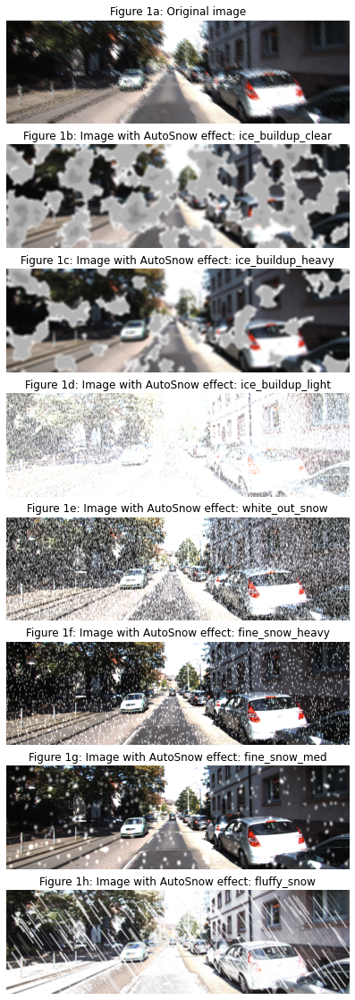

# AutoSnow: A synthetic winter image generator framework
Used to study and test object detection systems.

AutoSnow is a framework for generating synthetic winter image data from clear weather images by using simple python tools like NumPy and OpenCV. AutoSnow can efficiently transform images to generate 8 unique winter weather conditions. 
This project uses AutoSnow to generate synthetic winter datasets to test object detection models trained on clear weather data. We also provide the tools needed to test clear weather models on real winter data.  We use AutoSnow to generate synthetic winter testing data to retrain an object detection model in an attempt to make it more robust to real winter data. These models are included in the repo for experimentation

## Setup
To use this project please ensure the Numpy, OpenCV, and Pytorch libraries are installed on your system, this can be done using pip.
To install the third-party libraries used, please run all the cells in the provided notebook titled “Setup_libs"

## Third-party libraries
- [**YOLOv5:**](https://github.com/ultralytics/yolov5) This library is the object detection framework used in this project to train our models. It allows for easy training and utilization of models trained with different data. We used YOLOv5s model trained on the COCO dataset. Then we further finetune this model by training it with our dataset.
- [**Automold:**](https://github.com/UjjwalSaxena/Automold--Road-Augmentation-Library) This library is used for its method to generate snow on the ground.
- [**Object Detection Metrics toolkit:**](https://github.com/rafaelpadilla/review_object_detection_metrics)  This library provides a toolkit with a GUI for calculating the accuracy metrics for an object detection model. It input the prediction label and ground truth labels and outputs several accuracy metrics.

## Data
This project uses two datasets. The first was a clear weather dataset which we used to train the baseline clear model. A subset of this dataset would also be used as the clear weather test dataset, as well as forming the dataset used for transforming into winter data. The popular [KITTI 2D object detection dataset](http://www.cvlibs.net/datasets/kitti/eval_object.php?obj_benchmark=2d) is used.

Our second dataset was the [Canadian Adverse Driving Conditions Dataset (CADCD)](http://cadcd.uwaterloo.ca/) which is a winter weather driving dataset made by the University of Waterloo. This dataset was used as our real winter dataset and would be used to test our clear weather and synthetic winter models on real winter conditions.

Only a few samples immages of each dataset are included in this repo to keep in small (would be 30GB+ otherwise!). Please download these datasets separately and format them using the tools provided.

## How to use:
TODO
---
## Samples images
